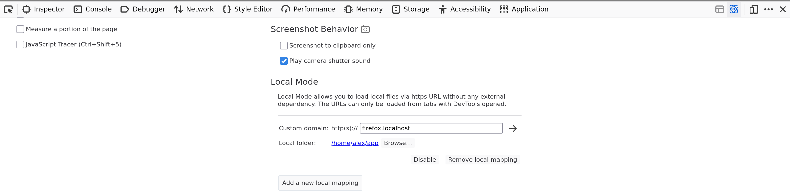
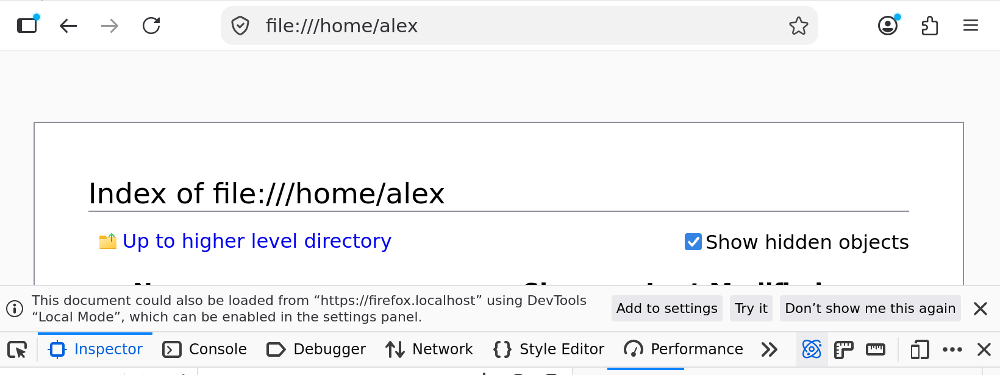

==========
Local Mode
==========

What is the "Local Mode"
************************

This feature allows you to register multiple mappings in order to load
local files through custom https:// URLs.
This prevents having to spawn a HTTP server to test a web page.
This make it easy to test all Web APIs, including the ones being restricted
to `Secure Contexts <https://developer.mozilla.org/en-US/docs/Web/Security/Defenses/Secure_Contexts>`_ (i.e. using https).
This also helps having many distinct origins (domain) for each experiment / project
and have dedicated storages/cookies for each.

These mappings are only accessible from Firefox (this can't be used by any other program,
or malicious software on your computer/local nerwork).

These mappings are only functional when DevTools are opened.

How to use the "Local Mode"
***************************

This features shipped in Firefox 153.

You can register mappings from DevTool's options panel:

|options-panel|

From there you can register as many mappings as you need.

Each mapping defines:

* the origin (domain)

  The custom origin to expose via https URL.

* the local folder

  The local folder where to load files from.

On the screenshot, it loads `https://firefox.localhost` from `/home/alex/app`

Loading file URL notification
*****************************

When loading any file: URL with DevTools opened, you should see the following notification
shown at the top of DevTools:

|file-notification|

The first action `Add To Settings` will bring you to the options panel and register
a new mapping for the loaded file URL.

The second action `Try it` will register a transient mapping to load the current file or folder
from a https URL. The mapping will disappear as soon as you close DevTools or Firefox.

